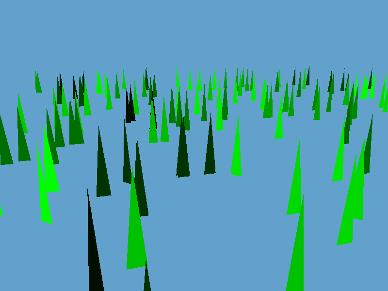

# The project

This is a grass renderer built using OpenGL and GLFW. The idea is to recreate the follow the [GDC talk](https://www.youtube.com/watch?v=Ibe1JBF5i5Y) of Ghost of Tsushima programmers to create beliveable grass.

## Dependcies

- GLFW
- OpenGL (Version > 4.5 for compute shader and DSA)
- Glad

# Steps

## Step 1 - Compute shader

In this [compute shader](shader/grassCompute.glsl) we create each blade of grass (position, height, width, etc, ...)

We start by generating 1024 blades of grass that are all represented by a point.

## Step 2 - Geometry shader

From the output of the compute shader, we want to create triangles that will look like grass. To do so, we send the buffers filled in the compute shader to the graphics pipeline shaders. In the vertex shader we use the vertexID to create a vertexData from the buffers. Each of the data represent a grass blade but for now it is only a position. To make the blades visible, we use a [geometryShader](shader/geom.glsl) which will generate triangles from the vertexData. For now, all the triangles have the same LOD (a unique triangle) and all of them are located at the center of their respective tile.

## Step 3 - Grass pattern

Now, instead of having regular grass pattern, we want to add some noise to the grass blades. We then have to redefined our way of representing grass blades. For now, all our grass blades will be located within the same tile.

- This tile is divided into a regular grid 
- For every intersection in that grid, we create a clump point (think of it as the center of a grass pattern, or as a voronoï vertex)
- We use a hash function to randomly jitter each of these clump points (we want a hash function and not some random noise so we don't have to store their values but just recalculate them everytime in the compute shader)
- For each of the grass blade we want to draw, we assign them a random position in 2D 
- We then find the 9 closest intersection in the grid (or less if it is at a corner, the top, the bottom, the left or the right of the grid)
- We then find the closest voronoï vertex to the grass blade (using now the jittered position of the previous 9 intersections)
- For every voronoï cells, we have defined custom information (blade's height, width, orientation, etc...) that we then use to create the vertex data of that blade that we will send to the vertex shader. In the following image, we have assigned a random color for each of the clumps (or voronoi areas) . We can see in the previous image that the z-buffer was not used resulting in a weird order for the triangles so we also fixed that at that stage.

## Step 4 - Rotation

We want now to add some rotation for each blade.

- First, we add some random roation in the compute shader ;

## Step 5 - LODs

To try different level of details, we will try to add new tiles.

- The first idea is to use the same compute shader for each tile and use the tile IDs in the random generations so they don't all look the same. Here we have 4 tiles, and the first one is displayed in red 

- Then, we create two kind of LODs for the tiles. Some tiles have high lod and others have low. Grass blades of high lod are made of 15 vertices and the ones of low lod are made of 7 vertices .

- Finally, we update the LOD value of the tile with respect to it's distance to the camera's position:
- When the tile is far from the camera  
- When the tile is near the camera 

## Step 6 bending

We Now add bending using bezier curves to control the bend;

- We use 3 control points, one at the origin of the blade. One at the tip of the blade which will control the tilt of the blade. One called "midpoint" which controls the bending of the curve. 

## Step 7 auto rotation

One idea to make the grass looks more dense without adding any information is to make the blades rotate as much as they can to avoid having their normals perpendicular to the view direction. Indeed, if the normals are orthogonal, it means that the blade will appear super slim and the screen will feel emptier. In their GDC talk, developpers of Ghost of Tshushima explained that they have made the blade "fold" toward the camera. Our idea is a bit simpler as we only slightly tilt the rotation of the blade around the y-axis to make it stay in front of the camera more often.

We can also adjust the effect in the geometry shader. However, if the rotation step is too big, the movement will be noticeable and the effect will seems more weird than helpful.

## Step 8 rounded normals

To make the blade look more like real grass, we will tweak their normals. In the GDC talk, Ghost of Tshushima's developpers used an arist made normal map. Because we are not artists, we have decided to try coding a similar effect.

- We start by derivating the bezier curves to get the tangent to the blade at each vertex. By crossing with the tangent on the width of the blade we get the surface normal at each vertex. To give the blades a rounded aspect, we then rotate the normals; to the left for the vertices on the left side of the blade and to the right for the vertices on the right side.

## Step 9 debugging

As visible in some of the previous figures, a lot of blades were stacked at the origin. After a lot of debugging, it appeared that the [std430 packing layout rules](https://www.oreilly.com/library/view/opengl-programming-guide/9780132748445/app09lev1sec3.html) is doing compiler optimizations and is aligning the stack to `4N` bytes when using elements made of `3` values. The issue was then due to the fact that I was using `vec3` for both the colors and the positions. This was creating a shift of one value for each element. For example, with `4` blades of grass set at position `(id,0,0)`, I would get:
- `position blade 0 = (0, 0 ,0),
- `position blade 1 = (0, 1 ,0),
- `position blade 2 = (0, 0 ,2),
- `position blade 3 = (0, 0 ,0)

instead of
- `position blade 0 = (0, 0 ,0),
- `position blade 1 = (1, 0 ,0),
- `position blade 2 = (2, 0 ,0),
- `position blade 3 = (3, 0 ,0)

resulting in a lot of blades being at position `(0,0,0)` and with a black color `(0,0,0)`.

## Step 10 better colors and lighting

The blades still look a bit boring. To make things more realistic, we will change how the blade colors are generated.

- First for the blade color, we use a gradient to make colors vary from a dark green color at the bottom to a yellowish color at the tip.

TODO: fix lighting system

